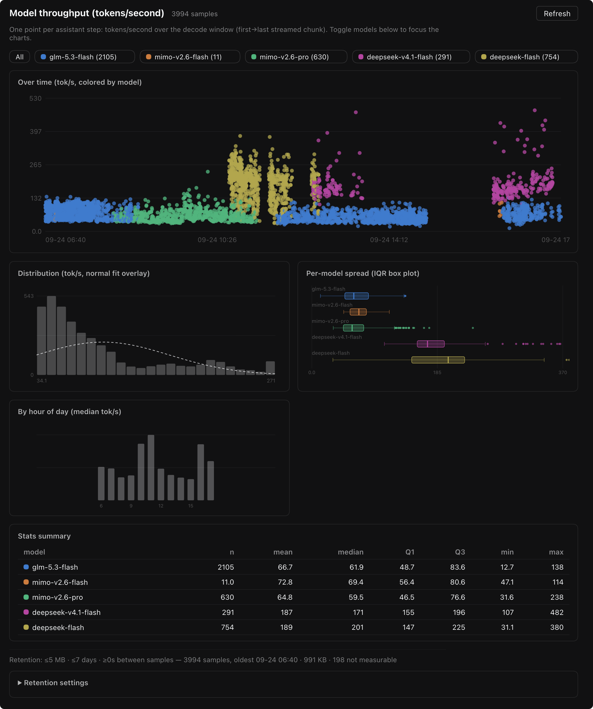

# dsh-plugin-tokspeed

A [DeepSeek Harness](https://github.com/deepseek-ai/deepseek-harness) plugin that records **per-step model decode throughput (tokens/second)** and charts it in the Web UI — so you can see how fast each model actually streams, how it varies by hour of day, and when the provider is having a slow day.

```text
┌────────── Over time (tok/s, colored by model) ──────────┐
│   ·    ·· ·      ·· ·  ··     ·  ·    ··   ·   ·       │
├──────────────┬──────────────────┬──────────────────────┤
│ Distribution │ Per-model spread │ By hour of day       │
│ (normal fit) │ (IQR box plot)   │ (median tok/s)       │
├──────────────┴──────────────────┴──────────────────────┤
│ Stats summary table (n · mean · median · Q1 · Q3 …)    │
└─────────────────────────────────────────────────────────┘
```

English · [简体中文](#简体中文)

## What it records

The Host half subscribes to the process-wide `session/event` feed and folds every durable `assistant/message` into one sample:

- **`tps`** — `usage.outputTokens` ÷ decode window (first→last streamed chunk), from the provider-reported token counts. This is the model's decode speed; the time-to-first-token wait is deliberately excluded and recorded separately.
- **`ttftMs`** — first chunk minus `step/start` (queue + network + prefill latency).
- **`model` / `provider`** — from the assistant message source.
- **`outputTokens` / `inputTokens` / `decodeMs` / `interrupted`** — the full context of each reading.

One sample per assistant step, across **all sessions** in the Host (main sessions, subagents, workflows), persisted as JSON lines.

`tps` is only reported when the decode window can carry the measurement. A window shorter than 250 ms measures delivery granularity rather than decoding, and an implied rate above `maxPlausibleTps` (default 500 tok/s) means the provider handed over the whole completion in one burst instead of streaming it. Those samples keep their timing and token counts and are marked `unmeasurable`, so the rate stays derivable while aggregates and charts stay honest — a single burst otherwise reports tens of thousands of tokens per second.

## Panel

The sidebar gains a gauge icon → a **Throughput** panel with five linked views over the same samples:



| View | What it answers |
|---|---|
| Scatter over time | When was it fast/slow? Colored per model, hover for details. |
| Histogram + normal fit | What does the speed distribution look like? If it is roughly normal, the bars peak at the mean and the dashed curve tracks them; a bimodal shape usually means two distinct regimes (e.g. peak vs off-peak hours). |
| Per-model IQR box plot | Which model is fastest, and how tight is the spread? Boxes span Q1–Q3 with a median line, 1.5·IQR whiskers, and outlier dots. |
| Hour-of-day medians | Is there a peak/off-peak pattern? |
| Stats table | Exact n, mean, median, Q1, Q3, min, max per model. |

Model chips above the charts toggle models on/off (hover a chip for **solo**). The layout is a responsive grid: one column on narrow windows, several on wide ones, capped at 1180px.

## Install

From the Harness Web UI: **Settings → Plugins → install bundle**, with:

```text
dsh-plugin-tokspeed
```

Or from a checkout:

```sh
git clone https://github.com/HuakunShen/dsh-plugin-tokspeed.git
dsh bundle install ./dsh-plugin-tokspeed
```

Then reload the Web page once. The recorder starts immediately; the panel appears in the sidebar.

## Configuration

Open **Settings → Plugins → tok speed** (the bundle's own configuration page), or set `config` on the bundle row in your profile patch:

| Option | Default | Meaning |
|---|---|---|
| `maxFileBytes` | `5242880` (5 MB) | File size cap; when the next sample would exceed it, the oldest lines are rotated out down to 75% of the cap. `0` disables. |
| `maxAgeDays` | `7` | Sample age cap in days; a periodic sweep drops older lines. `0` disables. |
| `sampleMinIntervalMs` | `0` | Minimum wall-clock gap between recorded samples. `60000` ≈ at most one sample per minute. `0` records every assistant step. |
| `maxPlausibleTps` | `500` | Ceiling on a credible decode rate. Faster readings are marked `unmeasurable` rather than reported, because they come from a provider delivering the completion in one burst. |
| `sweepIntervalMinutes` | `60` | How often the age/size sweep runs. |
| `includeSessionIds` | `true` | Write `sessionId` into each sample. Turn off for shared data directories. |
| `dataDir` | *(empty)* | Directory for `samples.jsonl`. Empty uses the DSH home (`~/.dsh/tokspeed/`), or the profile directory when `DSH_PROFILE_DIR` is exported. |

Whichever retention limit is hit first trims the data — the file never grows without bound.

## Data & routes

All routes are read-only, same-origin with the Web UI:

| Route | Content |
|---|---|
| `/dsh-tokspeed/samples.jsonl` | The raw store: one JSON object per line. |
| `/dsh-tokspeed/samples.csv` | CSV projection (`time_iso,model,provider,…,tps,…`) for spreadsheets and notebooks. |
| `/dsh-tokspeed/summary.json` | Per-model aggregates (`n/mean/median/p10/p90/min/max`), sample counts, file size, and the active retention settings. |

Sample shape:

```json
{"time":1790203495982,"provider":"zai-coding-cn","model":"glm-5.3-flash","turn":4,"step":47,"ttftMs":2420,"decodeMs":31995,"outputTokens":1478,"inputTokens":419,"tps":46.19,"interrupted":false,"sessionId":"session-…"}
```

## How it works

- The Host half folds the assistant message's compact stream records (`time0` + `dt` gap arrays) to reconstruct the exact decode window — no monkey-patching, no extra model calls, nothing model-visible changes.
- File mutations (append / rotate / sweep) are serialized through a promise chain, so concurrent events cannot interleave.
- All registrations ride the plugin fiber: disabling the bundle stops recording and unregisters the routes.

## Privacy

Samples contain model/provider names, token counts, timings, and (by default) session ids. No prompt or response content is ever recorded. Disable `includeSessionIds` if the data directory is shared.

## Known Limitations

- `tps` reflects the decode window only. A provider that buffers the completion and delivers it in a burst yields a window far shorter than the real decode time; such steps are marked `unmeasurable` instead of being reported as absurd rates.
- The store is one JSONL file per DSH home — plenty for weeks of retention, but it is not a time-series database.
- Failed attempts (`assistant/attempt`) are not sampled; only committed assistant messages are.

## Development

Plain JavaScript, no build step. After editing `index.js`, reload the entry from **Settings → Plugins** (disable → enable) — a Host restart is required for `index.js` changes to take effect, because Node caches the module. After editing `client.js`, reload the Web page.

```sh
node --check index.js && node --check client.js
node test/behavior-test.mjs          # 14 assertions against a fake Host context
node scripts/recompute-tps.mjs       # re-derive tps in an existing samples file (backup + --dry-run)
```

Stop the plugin before running `recompute-tps.mjs`: it rewrites the file the recorder appends to.

## License

[MIT](LICENSE) © Huakun Shen

---

## 简体中文

记录 DeepSeek Harness 中每个模型 step 的**解码吞吐（tokens/秒）**，并在 Web UI 侧边栏面板中画图。

- **记录内容**：每个 assistant step 一个点 —— `tps`（provider 精确 token 数 ÷ 解码时长）、`ttftMs`（首字等待）、模型名、token 数；覆盖主会话 / 子代理 / 工作流的全部会话
- **面板**：时间散点图、分布直方图（含正态拟合线）、每模型 IQR 箱线图、一天内时段中位数、统计表；模型 chip 可开关/单看；响应式多栏布局（见上方截图）
- **保留策略**：`maxFileBytes`（默认 5 MB，超限轮转最旧数据）与 `maxAgeDays`（默认 7 天，定期清扫）任一触发即自动清理；`sampleMinIntervalMs` 可限制采样频率；全部可在 Plugins 页配置
- **数据接口**：`/dsh-tokspeed/samples.jsonl`（原始 JSONL）、`/samples.csv`（CSV）、`/summary.json`（每模型聚合 + 保留策略快照）
- **隐私**：不记录任何对话内容，可选是否写入 sessionId

安装：Settings → Plugins → Install bundle，输入 `dsh-plugin-tokspeed`，装完刷新页面。
